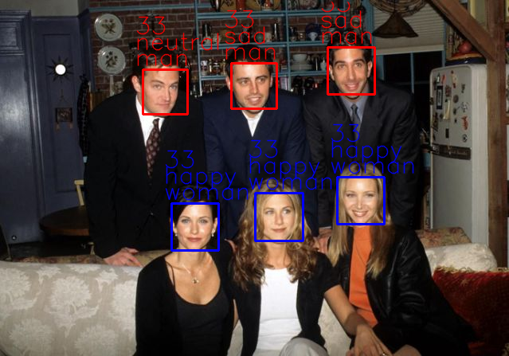

# Face classification and detection.
Real-time face detection and emotion/gender classification using fer2013/IMDB datasets with a keras CNN model and openCV.
* IMDB gender classification test accuracy: 96%.
* fer2013 emotion classification test accuracy: 66%.
* IMDB age regression test mae : 9.73 years.

For more information please consult the [publication](https://github.com/oarriaga/face_classification/blob/master/report.pdf) and https://data.vision.ee.ethz.ch/cvl/rrothe/imdb-wiki/

# Demo :

*Just put an image of a group into the "input" folder and run the main.py file :
> python3 main.py

*It will predict on the images provided and change the classes using autoencoder / "deblur" the result.

# Emotion/gender/age examples:

## Instructions

### Make inference on single images:
> python3 image_emotion_gender_age_demo.py <image_path>

e.g.

> python3 image_emotion_gender_age_demo.py ../images/friends_image4.jpg

### To train previous/new models for emotion classification:

* Download the fer2013.tar.gz file from [here](https://www.kaggle.com/c/challenges-in-representation-learning-facial-expression-recognition-challenge/data)

* Move the downloaded file to the datasets directory inside this repository.

* Untar the file:
> tar -xzf fer2013.tar

* Run the train_emotion_classification.py file or the jupyter notebook train_emotion_model.ipynb
> python3 train_emotion_classifier.py

### To train previous/new models for gender classification:

* Download the imdb_crop.tar file from [here](https://data.vision.ee.ethz.ch/cvl/rrothe/imdb-wiki/) (It's the 7GB button with the tittle Download faces only).

* Move the downloaded file to the datasets directory inside this repository.

* Untar the file:
> tar -xfv imdb_crop.tar

* Run the train_gender_classification.py file
> python3 train_gender_classifier.py

### To train previous/new models for age regression:

* Run the train_age_classifier.py file
> python3 train_age_classifier.py
* Then run the train_age_regressor.py file
> python3 train_age_regressor.py

# Face modification
## With C-GAN 

* Run the train_cGAN.py file
> python3 train_cGan.py

## With autoencoder 

### To train :
* Follow instruction in AutoencoderV2.ipynb to train the encoder

### To use the autoencoder :
* To try it on pictures put them in the input directory then run the main_ae.py file
> python3 main_ae.py
* Your pictures processed will be in the ./output folder
